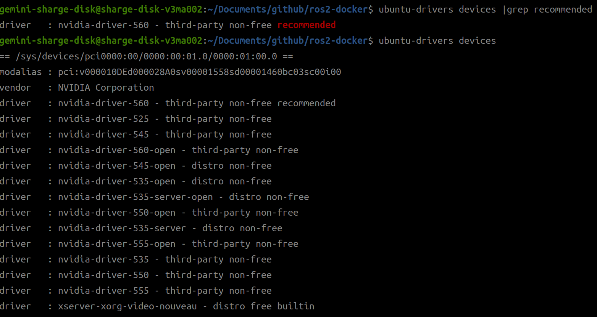
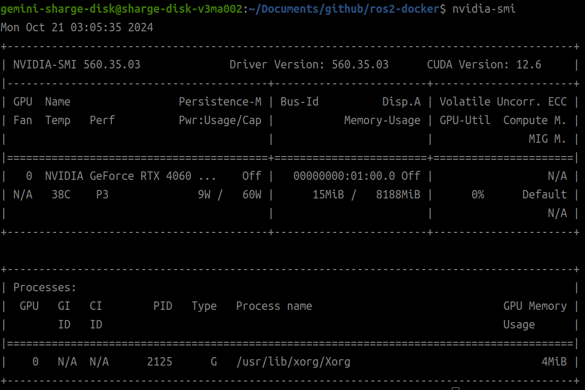
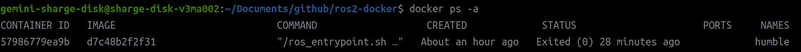

今回はros2用のコンテナ内でGPUが使用できるようにするが、CUDAのインストールには関知しない。
仮にコンテナ内でcudaを用いたい場合は、別途インストールすること。


# 事前準備
## Nouveua(ヌーヴォー)の無効化
NouveuaはNVIDIAのオープンソースドライバで、Ubuntuのデフォルトで使われているが、NVIDIAのGPUを使うときには非推奨。
このステップを無視していきなりNVIDIAドライバを入れると、Nouveuaと競合してしまい、GPUが使えなくなる可能性があるらしい。

ただ、筆者は普通にNouveua無効化ステップをすっ飛ばしてNVIDIAドライバを入れても問題なかった（自動で無効化される？）。よう分からんけど、まあ念の為無効化しときましょ。

`lsmod | grep -i nouveau`

と入れ、何か表示されるようなら、無効化する。

`/etc/modprobe.d/blacklist-nouveau.conf`を作成し、以下を記述

```bash
blacklist nouveau
options nouveau modeset=0
```
ファイルを保存し、以下を実行することで設定を再読込する

`sudo update-initramfs -u`

## NVIDIAドライバのインストール
ドライバがすでに入ってないことの確認

`dpkg -l | grep nvidia`

と入れ、何も出てこなければOK。このままインストールのステップ(最新バージョンのインストール)に進む。

すでにドライバが入っており、それが古いバージョンの場合は、アップデートするために一度削除する。（古いかどうか確かめる方法は次のステップに後述）

### すでにあるNVIDIAドライバが古いものか確かめる方法
`dpkg -l | grep nvidia-driver`

と入れる。

```bash
ii  nvidia-driver-550                          550.35.03-0ubuntu1                      amd64        NVIDIA driver metapackage
```
のように出てきた場合、`nvidia-driver-550`の**550**がバージョン番号にあたるので覚えておく。

`ubuntu-drivers devices |grep recommended`

と入れ、出てきたものを確認する。

```bash
driver   : nvidia-driver-560 - third-party non-free recommended
```

とあるので、**560**が最新バージョンかつ推奨(recommended)だとわかる。
550より560のほうが新しいので、550を削除して560をインストールする。

### 古いバージョンの削除
`sudo apt-get --purge remove nvidia-*`

### 最新バージョンのインストール
#### 自動インストール
ドライバの選択方法を「手動インストール」にて後述するが、面倒な人は

`sudo ubuntu-drivers autoinstall`

というコマンドで自動で最新のドライバをインストールすることもできる。

#### 手動インストール
オートでなく手動でやりたい硬派な人は以下を実行する。

`ubuntu-drivers devices |grep recommended`

を入力。

```bash
driver   : nvidia-driver-560 - third-party non-free recommended
```

が出てきたら、「`nvidia-driver-560`」の部分をメモしておく。

何も出てこなければ、

`ubuntu-drivers devices`

と入れ、`「nvidia-driver-○○○`」の部分のうち、数値の一番大きいものを選択。



以下を実行する（○○○の部分は適宜変更すること）

```bash
sudo add-apt-repository ppa:graphics-drivers/ppa
sudo apt update
sudo apt install nvidia-driver-○○○
```
インストールを終えたら、再起動することでドライバのインストールが完了する。

`sudo reboot`

### ドライバ起動チェック
再起動したら、ターミナルから以下を入力し、ドライバが正常にインストールされているか確認する。

`nvidia-smi`



参考: https://qiita.com/porizou1/items/74d8264d6381ee2941bd


# docker, nvidia-docker2, rockerのインストール

`bash install_prerequired.sh`と入れると、docker、nvidia-docker2、rockerが自動でインストールされる。 


# Dockerfileのイメージビルド

ros2 humbleを入れる場合には、以下を実行する。

`bash build_Dockerfile.sh`

初回だと20~30分ほどかかるので、気長に待とう。（2回目以降はキャッシュを用いて早く行われる）

完了後、`docker images ls -a`を入れると、以下のように`ros2_humble`というイメージが作成されていることが確認できる。

`build_Dockerfile.sh`の`IMAGE_NAME`を変更して、新たなイメージを作成することもできる。

# コンテナの作成

`bash create_container.sh`を実行すると、`ros2_humble`という名前のコンテナが作成される。

以降は`docker start ros2_humble`でコンテナに入ってterminatorを起動できる。

終了するときは、ホスト側に`docker stop ros2_humble`を入れる。

Ctrl+CやCtrl+D、他にもCtrl+P→Ctrl+Qなどでコンテナから抜けることはできるが、コンテナ自体はバックグラウンドで動いたままなので、`docker stop ros2_humble`を入れてコンテナを停止させること。

# 動作確認
さきほどイメージを作成した際に自動でコンテナに入っているので、以下のコマンドを実行して動作確認を行う。

`rviz2`

と入れると、ホスト側の画面に`rviz2`が表示される（`rviz2`と打ったターミナルでCtrl+Cを押すとrviz2を閉じられる）。

次に、`nvidia-smi`を入れdockerコンテナ内からGPUの情報を取得できることを確認する。（添付画像において`docker attach humble`をしてもユーザー名が変わっていない点に関しては無視してください）


また、Ctrl+Dを押すと、コンテナから抜けることができる(Dはdetachの略で、単に抜けるだけでありバックグラウンドプロセスとして動いていることに注意)。

コンテナを終了させたいときは、`exit`と入れればいい。

# 2回目以降のコンテナの立ち上げ方

`docker ps -a`を入れると、コンテナの一覧が表示される。(`ps`はprocessの略で、オプション`-a`は全てのコンテナを表示するためのもの)



`STATUS`の列が`Exited~`になっていれば、正常に終了している。

もしも`STATUS`が`Up~`になっている場合は、バックグラウンドで動いているので、`docker stop humble`と入れてコンテナを停止させる。

コンテナを再度立ち上げたいときは、`docker start humble`と入れればいい。

`docker start humble`だけでは立ち上げるのみでコンテナに入れないので、続けて`docker attach humble`と入れることでコンテナに入ることができる。

コンテナを削除したい場合は、`docker rm ros2_humble`と入れる。なお、実行中(STATUSがexited~でない)のコンテナは削除できないので、`docker ps -a`で確認し、必要ならば`docker stop humble`を入れてから削除すること。(`docker rm -f ros2_humble`と入れると強制削除できるが、おすすめしない)

コンテナ内で複数ターミナルを実行したい場合、`terminator`と入力する。terminatorはROSを使う上で非常に便利なので使い方は各自で調べておこう！

参考: 

https://cryborg.hatenablog.com/entry/2016/09/03/164940

https://note.com/shirakawa_lab/n/n4f28232cb7c9

https://qiita.com/memristor09/items/4cf351a16629f7ddc377


その他参考サイト

https://qiita.com/porizou1/items/76980fbd0d1675eecf7f

https://qiita.com/porizou1/items/8bf56efc3307e40624af